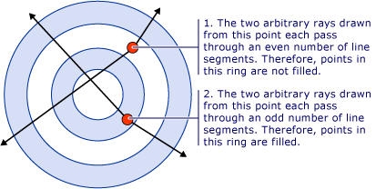

% 2D Graphics Primer
% Sundaram Ramaswamy
% April, 2017

# Good ol' drawing

1. Let's draw something simple!
2. Map backwards by learning the theory :)
3. See code to seal the understanding
4. _Rise, repeat_

> **Warning:** This is a primer.  Chances are you might know a lot more than the presenter and the presented!

# Reasons

* Prefer breadth-wise coverage
    + Allows to cover more concepts
    + Pretty pictures are better motivators :)
    + Learning concepts in isolation doesn't encourage you to jump-in
    + Beginners wouldn't appricate digging deep; can always do it alone once motivated
* Favour intuition over rigour
    + Tries to be an "enabler" not a _Reference Guide_
* Concepts are API-agnostic
    + D2D used here but works just as well in say HTML5 canvas, SDL, etc.

# Let's Draw!

{ width=100% height=100% }

# Concept: Path / Geometry

* A *mathy* way to remember an artist's work
    + Store every point
        * Where did he put his brush down?
    + Store every hand move
        * Did he draw a line or a curve?

> Example: move to `(5, 5)`, line to `(10, 5)`

* It's just data about **shapes**
    + Hear path/geometry, think **shapes**
    + Data by itself
        * Doesn't talk about how it's used
        * Doesn't depend on hardware/device
        * is plain-old data; no magic
* Once stored this way, any _reader_ can imitate the artist
    + Reader may be a human, computer, graph plotter, …

# Path (contd.)

* Usually has `move to`, `line to`, `curve to`, `arc`, …
    + Curves are quadratic and cubic Bézier curves
* Each figure has `begin` and `end` (with/out `close`)
    + `close` closes by drawing a line between first and last points
* Don't be intimidated by path drawing command languages
    + They are shorthand notations for the above commands
    + Without its cumbersome to construct figures
    + Creation in code is manual; each command is a function
    + [XAML](https://msdn.microsoft.com/en-us/library/ms752293.aspx): `M 10, 100 L 20, 100`
    + PDF: `10 100 m 20 100 l`
* Represent any artibrary shape: polygon
* Multiple disjoint figures within a single path geometry

# Drawing paths: stroke

One, obvious, way to use paths: draw them

**Stroke**: trace the outline of the geometry's figures.

The brush used by the artist has

+ Colour
+ Thickness
+ Dash pattern: think _dotted line_
+ Line cap style
    * Butt cap  `|---|`
    * Round cap `(---)`
    * Square cap `| --- |`
+ Line join style
    * Round join `u`
    * Round join `\_/`
    * Miter join `V`
+ Miter limit: max height when joining two line ends

# Drawing paths: fill

* Filling the interior of a path with some brush
    + When unclosed, it's implicitly closed by D2D
    + PDF doesn't honour fill, if unclosed
* But wait, what's *inside* for
    + One sub-path inside another?
    + Self-intersecting paths?
* [Winding rule](https://msdn.microsoft.com/en-us/library/windows/desktop/dd368110(v=vs.85).aspx)
    + Even-odd
    + Non-zero

# Even = fill, Odd = no fill
{ width=100% height=100% }

> Credit: MSDN

# Non-zero Fill
{ width=50% height=50% }

> Credit: MSDN

# Resource: Brushes

Brushes, also called, pens do stroking & filling

Not necessarily solid colours; they can be

+ Solid
    * Refer the same colour always
+ Position-based
    + Gradient: colour based on a function
        + Linear
        + Radial
    + Bitmap
        * Refer colour from a lookup table

# Concept: Interpolation

* Given the extremes, find values in between
