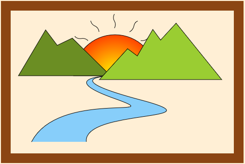
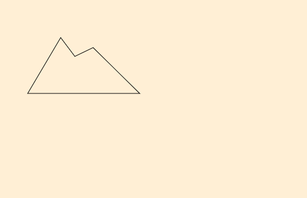
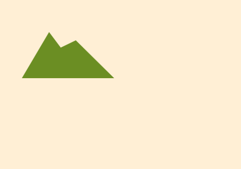
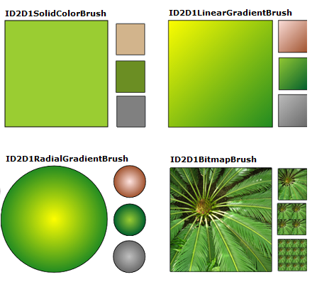
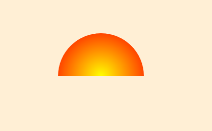
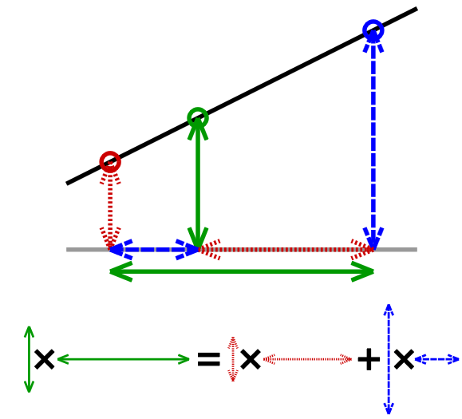

% 2D Graphics Primer
% Sundaram Ramaswamy
% April, 2017

# Good 'ol drawing

1. Let's draw something simple!
2. Map backwards by learning the theory :)
3. See code to seal the understanding
4. _Rise, repeat_

> **Disclaimer**: This is a primer.  Chances are you might know a lot more than the presenter and the presented!

# Reasons

* Prefer breadth-wise coverage
    + Allows to cover more concepts
    + Pretty pictures are better motivators :)
    + Learning concepts in isolation doesn't encourage you to jump-in
    + Beginners wouldn't appricate digging deep; can always do it alone once motivated
* Favour intuition over rigour
    + Tries to be an "enabler" not a _Reference Guide_
* Concepts are API-agnostic
    + D2D used here but works just as well in say HTML5 canvas, SDL, etc.

# Let's Draw This

{ width=100% height=100% }


# Dissection 1

**Git train**: _Stroke_ station, coming up!

> `git checkout tags/Stroke`

{ width=50% height=50% }

# Concept: Path / Geometry

* A *mathy* way to remember an artist's work
    + Store every point
        * Where did he put his brush down?
    + Store every hand move
        * Did he draw a line or a curve?

> Example: move to `(5, 5)`, line to `(10, 5)`

* It's just data about **shapes**
    + Hear path/geometry, think **shapes**
    + Data by itself
        * Doesn't talk about how it's used
        * Doesn't depend on hardware/device
        * is plain-old data; no magic
* Once stored this way, any _reader_ can imitate the artist
    + Reader may be a human, computer, graph plotter, …

# Path (contd.)

* Commands: `move to`, `line to`, `curve to`, `arc to`, …
    + Curves are quadratic and cubic Bézier curves
* Each figure has `begin` and `end` (with/out `close`)
    + `close` closes by drawing a line between first and last points
* Don't be intimidated by path drawing languages
    + Just shorthand notations for these commands
    + It’s cumbersome to construct figures otherwise
    + [XAML](https://msdn.microsoft.com/en-us/library/ms752293.aspx): `M 10, 100 L 20, 100`
    + PDF: `10 100 m 20 100 l`
* Represent any artibrary shape: polygon
* Multiple disjoint figures within a single path geometry

# Drawing paths: stroke

One, obvious, way to use paths: draw them

**Stroke**: trace the outline of the geometry's figures.

The brush used by the artist has

+ Colour
+ Thickness
+ Dash pattern: think _dotted line_
+ Line cap style
    * Butt cap  `|---|`
    * Round cap `(---)`
    * Square cap `| --- |`
+ Line join style
    * Round join `u`
    * Round join `\_/`
    * Miter join `V`
+ Miter limit: max height when joining two line ends

# Dissection 2

**Git train**: next stop, _Fill_ station!

> `git checkout tags/Fill`

{ width=50% height=50% }

# Drawing paths: fill

* Filling the interior of a path with some brush
    + When unclosed, it's implicitly closed by D2D
    + PDF doesn't honour fill, if unclosed
* But wait, what's *inside* for
    + One sub-path inside another?
    + Self-intersecting paths?
* [Winding rule](https://msdn.microsoft.com/en-us/library/windows/desktop/dd368110(v=vs.85).aspx)
    + Even-odd
    + Non-zero

# Even = fill, Odd = no fill
{ width=100% height=100% }

> **Credit**: MSDN

# Non-zero Fill
{ width=50% height=50% }

> **Credit**: MSDN

# Resource: Brushes

Figures are fine but what about the colours used to draw?

> **Brushes**, also called, **pens** do stroking & filling.

Didn’t speak about its colour thus far; it can be

+ Constant
    * Solid: refers the same colour always
+ Varies by position
    + Gradient: get colour based on a function of position
        + Linear
        + Radial
    + Bitmap
        * Get colour from a lookup table

# Brush Types
{ width=50% height=50% }

> **Credit**: MSDN

# Concept: Colours

* Need a precise way of representing colours
* Colour spaces
    + RGB
    + HSV and HSL
    + CMYK
    + many more
* Most rendering APIs work in RGB
    + Additive colour system
    + This is how display systems work
    + Easy math: simple calculations
    + Unintuitive interpolation
* HSV is preferred by artists
    + Most aesthetically pleasing
    + Better for colour pickers
    + Intuitive interpolation

# Pixel formats

* Colour value is math; its realisation in hardware leads to

> **Pixel**: picture element

* Irrespective of colour space, data type decides richness
    + Wider the format, richer the gamut
* Integer formats: `0` darkest; `max(channel width)` brightest
    + 32-bit pixel formats: `A8 R8 G8 B8`, `R8 G8 B8 A8`, …
    + 24-bit pixel formats: `R8 G8 B8`, …
    + 16-bit pixel formats: `R5 G6 B5`, `A4 R4 G4 B4`, `R5 G5 B5`, …
    + 8-bit pixel formats: indexing a predefined colour palette
* Floating-point formats: `0.0` darkest, `1.0` brightest
    + Costly: `4 * 32 = 128` bits for RGBA
    + Better for image manipulation
* If exceeds during calculation, it's `clamp` ed by `min` and `max`

# Dissection 3

**Git train**: _Gradient_ station, coming up!

> `git checkout tags/Gradient`

{ width=50% height=50% }

# Concept: Interpolation

$$
\put(-80,0){\color[rgb]{0,0,0}\circle*{7}}
\put(-82,-18) 0
\put(-60,0){\color[rgb]{0.125,0.125,0.125}\circle*{7}}
\put(-40,0){\color[rgb]{0.25,0.25,0.25}\circle*{7}}
\put(-20,0){\color[rgb]{0.375,0.375,0.375}\circle*{7}}
\put(0,0){\color[rgb]{0.5,0.5,0.5}\circle*{7}}
\put(-3,-18){$\frac{1}{2}$}
\put(20,0){\color[rgb]{0.625,0.625,0.625}\circle*{7}}
\put(40,0){\color[rgb]{0.75,0.75,0.75}\circle*{7}}
\put(60,0){\color[rgb]{0.875,0.875,0.875}\circle*{7}}
\put(80,0){\circle{7.6}}\put(80,0){\color[rgb]{1,1,1}\circle*{7}}
\put(78,-18) 1
$$

* Colour at `0` is black `(0, 0, 0)`
* Colour at `1` is white `(1, 1, 1)`
* What's the colour at `½`?
* It's pure grey: `(½, ½, ½)`.  But how?

> **Interpolation**: Given two values, guess/find values in between

Works with any values: position (any dimension), temperature, say even chilli hotness (scoville heat index), etc.

$$
\put(-80,0){\color[rgb]{1,0,0}\circle*{7}}
\put(-95,-25){(1, 0, 0)}
\put(-60,0){\color[rgb]{0.875,0.125,0}\circle*{7}}
\put(-40,0){\color[rgb]{0.75,0.25,0}\circle*{7}}
\put(-20,0){\color[rgb]{0.625,0.375,0}\circle*{7}}
\put(0,0){\color[rgb]{0.5,0.5,0}\circle*{7}}
\put(-18,-25){$(\frac{1}{2}, \frac{1}{2}, 0)$}
\put(20,0){\color[rgb]{0.375,0.625,0}\circle*{7}}
\put(40,0){\color[rgb]{0.25,0.75,0}\circle*{7}}
\put(60,0){\color[rgb]{0.125,0.875,0}\circle*{7}}
\put(80,0){\color[rgb]{0,1,0}\circle*{7}}
\put(65,-25){(0, 1, 0)}
$$

# Linear Interpolation a.k.a lerp

$$
\boxed{V(t) = (1 - t) V_0 + t V_1}
$$

```
t          0         1
  |--------P--x------Q------------->
X 0        9  ?      19
```

Given $P$ and $Q$, find the value at $t = 0.3$

$$
V(0.3) = 0.7 P + 0.3 Q = 0.7 (9) + 0.3 (19) = 12
$$

{ width=50% height=30% }

# Linear Gradient Brushes

Interpolates colours (stops) along an axis (line)

{ width=50% height=50% }
{ width=50% height=50% }

> **Credit**: MSDN

# Radial Gradient Brushes

Think of it as linear interpolation between concentric circles

{ width=75% height=75% }

> **Credit**: MSDN

# Bitmap Brushes

Index from an image / texture / bitmap --- look-up table --- with position

# Tiling and Pattern Brushes

# Transformations

* Concise representation of changes to points
* Usual operations
    + Scale
    + Rotate
    + Translate
    + Shear
    + Flip/Mirror
* Matrices are used extensively in all graphics APIs
    + Can concatenate multiple transforms into one complex transform
* Internalize them by playing with simple "Hello, World" program
* [2D Transforms 101](http://legends2k.github.io/2d-transforms-101/): a supplementary presentation with interactive animations

# Clipping

* Drawing --- stroking & filling --- by default is conceptually boundless
* In reality, you're bound by the paper / canvas
* On a computer, you're bound by the surface dimension

> **Clip**: additional bounds to drawing operations

* Can be *any* geometry (think *shape*), not necessarily rectangles
* Rectangles are usually faster though
* *Inside*ness is decided by the same rules as *fill*
* Clips are combined by intersection

# Text
